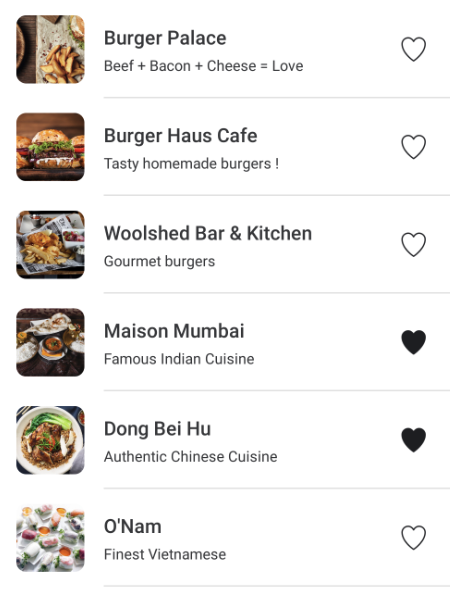

# Wolt Mobile app assignment

## Concept

A user is walking around the Helsinki city center looking for a place to eat.

## Task

### Description

Create an application that performs the following functions:

1. Continuously display a list of up to 15 venues near the user’s current location. If the API returns more than 15 venues display only the first 15 from the list.
2. The user’s location should update every 10 seconds to the next coordinate in the provided input list (in this document). After the last location in the list, the app should loop back to the first location and repeat the sequence.
3. The venue list should automatically refresh to reflect the new location with a smooth transition animation to enhance visual appeal.
4. Each venue should have a “Favourite” action that toggles (true/false) and changes the icon depending on the state. The app must remember these favorite states and reapply them to venues that appear again even after the app is restarted.

### Location Update Timeline Explanation

| Time passed after opening the app | Current location |
|-----------------------------------|------------------|
| 0 seconds                         | `locations[0]`   |
| 10 seconds                        | `locations[1]`   |
| 20 seconds                        | `locations[2]`   |
| ...                               | ...              |
| (10 * locationsCount) seconds     | `locations[0]` (looped) |

- **0 seconds**: Display venues near `locations[0]`.
- **10 seconds**: Update display to venues near `locations[1]`.
- **20 seconds**: Update display to venues near `locations[2]`.
- Continue updating every 10 seconds until the end of the list is reached, then loop back to `locations[0]` and repeat.

## API Endpoint

`GET https://restaurant-api.wolt.com/v1/pages/restaurants?lat=60.170187&lon=24.930599`

### Important fields in response (JSON)

| Path / Key                                | Meaning                           |
|-------------------------------------------|-----------------------------------|
| `sections -> items -> venue -> id`        | Unique ID of the venue            |
| `sections -> items -> venue -> name`      | Name of the venue                 |
| `sections -> items -> venue -> short_description` | Description of the venue       |
| `sections -> items -> image -> url`       | Image URL for the venue           |

### Coordinates (latitude, longitude)

- `60.169418, 24.931618`
- `60.169818, 24.932906`
- `60.170005, 24.935105`
- `60.169108, 24.936210`
- `60.168355, 24.934869`
- `60.167560, 24.932562`
- `60.168254, 24.931532`
- `60.169012, 24.930341`
- `60.170085, 24.929569`

## Example Assets

- [Favorite (true)](https://fonts.google.com/icons?selected=Material+Icons:favorite) 
- [Favorite (false)](https://fonts.google.com/icons?selected=Material+Icons:favorite_border) 

## Example of Minimal Design

## How to do it in practice

1. Clone this repository
2. Checkout a new branch git checkout -b my-implementation
3. Implement your solution and push the changes to your branch
4. Once you're done
    1. Open a PR (pull request). Feel free to add comments in the PR.
    2. Inform the recruiter that you've finished the assignment

## What we appreciate as reviewers

We value your effort in developing a feature-ready and fully functional submission for release, which we expect to be well-structured, clean code of good quality, testable and reactive, with some test coverage, as well as incorporating creative and well-designed UI/UX elements including some animation, mirroring how real product features are developed

## FAQ

**Does my app need to support different screen orientations?**

No, portrait mode is sufficient.

**Do I need to strictly follow the design example?**

The provided mockup is just a suggestion. Feel free to design the UI your own way as long as it contains the same information.

## Notes from the applicant

> Please write here if you want to explain the choices you made on the way :).
